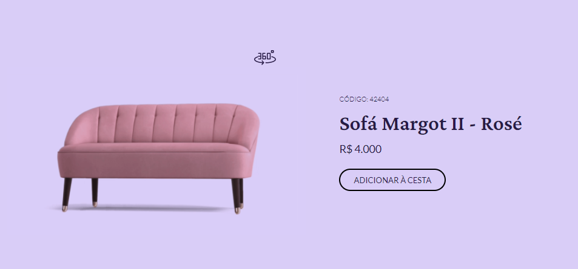

# #BoraCodar desafio 02! ✔
Mais um desafio do projeto #BoraCodar da rocketseat! 🎉

Dessa vez o desafio foi ddesenvolverum site apresentando um produto. No site contém iinformaçõesdo produto e o mais legal, você tem a opção de visualizar o produto em 360

[veja o projeto aqui!](https://gabriel-vitebo.github.io/BoraCodar-desafio-02-Product/) 💻📱

 

## Nesse desafio eu usei:
- HTML ✔
- CSS ✔
- JavaScript ✔